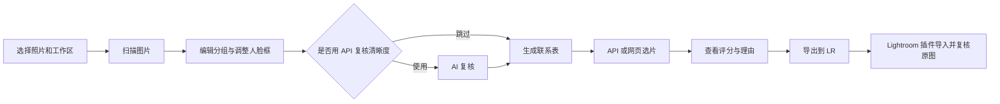

# AI选片助手

**从一整批 RAW，到可在 Lightroom 复核的星级与弃置结果。**

本地人脸与清晰度检查、连拍分组、联系表、可选 AI 复核与选片，以及 Lightroom Classic 目录插件。适合需要先整理大量人物照片、再在 Lightroom 中看原图做最后判断的工作流。

**原照片始终留在原目录。** 软件不复制精选、不移动或删除原片；“弃置”是导出给 Lightroom 的标记。

[下载 Windows 便携版](https://github.com/moyansang/photo-cull-assistant/releases/latest) · [使用指南](docs/user-guide.md) · [常见问题](docs/faq.md) · [更新日志](CHANGELOG.md) · [报告问题](https://github.com/moyansang/photo-cull-assistant/issues/new/choose)

## 下载与开始

1. 在 [Releases](https://github.com/moyansang/photo-cull-assistant/releases/latest) 下载 `AI-Photo-Cull-v1.5.4-Windows-x64-portable.zip`。GitHub 自动提供的 **Source code** 是源码，不是可运行 EXE。
2. **完整解压**到可写目录，运行其中的 `AI选片助手.exe`。不要只拿走 EXE，旁边的 `_internal` 和 `lightroom` 需要保留。
3. 选择照片目录和独立工作区，点击 **扫描图片**。使用便携包无需安装 Python；本地扫描无需 API Key。
4. 新版可直接选择原有工作区。API Key 保存在当前 Windows 用户的凭据管理器，更换电脑需要重新填写。

当前版本：**v1.5.4**。改善人脸预览切换，复用原尺寸清晰度细节，减少重复解码；见 [v1.5.4 发布说明](docs/releases/v1.5.4.md)。

## 一次选片怎么完成

| 阶段 | 做什么 | 是否需要 API |
|---|---|---|
| 扫描图片 | 本地检测人脸、初筛虚焦/抖动、分组 | 不需要 |
| 编辑分组与人脸 | 拆组、合组、框选漏检脸；仅重新扫描修改照片 | 不需要 |
| AI 复核 | 对清晰度待确认照片进行二次判断 | 需要，可跳过 |
| 生成联系表 | 根据当前分析和人脸框排版 | 不需要 |
| AI 选片 | API 自动提交，或合并材料手动上传大模型网页 | 网页方式不需要 Key |
| 导出到 LR | 合并本地弃置、AI 清晰度状态与 AI 星级/弃置 | 不需要 |

**清晰度待确认不是清晰。** 当前筛查流程中，待确认照片不进入正式 AI 选片；可以导出到 Lightroom 的“清晰度待确认”智能收藏夹处理。AI 复核明确判断模糊时直接记为弃置，不删除照片。

## 核心功能

- **保留分析，增量处理**：关闭后恢复分组、人脸、日志、AI 回答与任务状态。v1.5 删图后移除对应记录；新增文件提示数量，点击扫描只处理新增或 RAW/JPG 配对变化的照片。
- **跨电脑重新定位**：移动硬盘盘符变化时，在原工作区点击“重新定位原照片”，核对后更新路径，保留分组、人脸调整、AI 评分和暂停进度。
- **人脸细节可直接编辑**：预览中拖拽补框，点击绿框内部变黄后上下左右拖动；滚轮微调范围，逐张保存裁切比例与位置；一键找下一张未标记照片。
- **保守的技术筛查**：原尺寸人脸/眼部细节、本地证据与可选 API 复核。身体清晰度检查是默认关闭的实验选项。
- **两种 AI 选片方式**：共用偏好和结果；网页可一次合并多个批次，用一份完整提示词提交。也可先 API 复核清晰度，再网页选片。
- **Lightroom 原位应用**：插件写入 Catalog 的星级、旗标、AI 理由和清晰度待确认关键词，不直接编辑 `.lrcat`，不覆盖调色。
- **自动并行与续做**：按 CPU、可用内存和实测吞吐量选择 1/2/4/6/8 张并行；已完成照片增量保存。停止后继续时，仅未完成部分使用新设置。
- **工作区整理与更新**：关闭/切换时按条件归档状态、清理可重建缓存；保留联系表、提交材料和 LR 导出。启动可检查更新，也可关闭自动检查。

## API 与数据

主页面 **配置 API** 提供百炼/Qwen、智谱/GLM、OpenAI、DeepSeek 及自定义预设；预设是参数模板，实际模型可用性、图片能力和价格以你的服务账户为准。仅支持带图片的 **OpenAI-compatible Chat Completions** 协议。

本地扫描不发送照片。点击 API 复核/选片后，会向你配置的服务发送所需预览、细节图片或联系表及提示词；网页方式由你自己上传。Key 不写入工作区 JSON。测试连接也可能产生服务调用费用。[配置与提交说明](docs/user-guide.md#api-与网页提交)

## Lightroom Classic

便携包自带 `lightroom/PhotoCullAssistant.lrplugin`。在 **文件 → 增效工具管理器 → 添加** 中选择整个插件目录；之后通过 **文件 → 增效工具附加功能 → 导入 AI选片助手结果** 导入工作区导出的 `lightroom_results.json`。

导入后在图库 **元数据 → AI选片助手** 查看 AI 理由。RAW/JPG 分别按完整路径匹配，未导入 Catalog 的 JPG 会列为未匹配，不代表 RAW 也失败。[完整安装说明](lightroom/安装与使用.txt)

插件自身不写 XMP；若要避免 Lightroom 自动创建 XMP，请检查 Lightroom 的“自动将更改写入 XMP”设置。

## 使用边界

- 清晰度判断仍可能漏检或误判。舞台灯光、小脸、侧脸、遮挡和背景人像尤其困难，最后请在 Lightroom 查看原图。
- YuNet 与头部补救定位可辅助找框；检测到后脑勺不等于能判断五官清晰度。当前不承诺自动识别全部合影成员并逐人保证清晰。
- **当前正式版使用 CPU，没有 GPU 加速。** GPU RAW 研究已撤回，未作为正式功能发布。
- RAW 支持取决于随包 LibRaw 能力。RAW/JPG 同名配对沿用现有逻辑；不同子目录含多个同名照片时建议拆成不同批次。
- 移动/重命名原照片会按旧文件移除、新文件新增处理；同一路径内容被修改仍需重新扫描。磁盘/整个源目录无法访问时保留记录并报错。
- 已保存的待提交/过时 AI 结果可以归档；**正在进行的本地处理任务**需要保留恢复缓存，可能阻止整理。

## 文档与开发

- [详细使用指南](docs/user-guide.md)：流程、目录、更新、停止与继续。
- [常见问题](docs/faq.md)：缺图、新增照片、慢扫描、LR 匹配与模糊漏检。
- [完整版本索引](CHANGELOG.md)：v0.3 → v1.5.2；[历史 Release 原文](docs/release-history.md)。
- [清晰度验证](docs/clarity-v2-validation.md)、[扫描性能](docs/scan-performance.md)：包括样本规模和验证限制。
- [开发与打包](docs/development.md)、[贡献说明](CONTRIBUTING.md)、[第三方来源](docs/third-party.md)。

历史实验结论不等于当前版本在任意相机、场景上的准确率保证。项目未提供整体软件的统一开源许可证；第三方模型和代码按各自许可证使用，参见来源说明。
